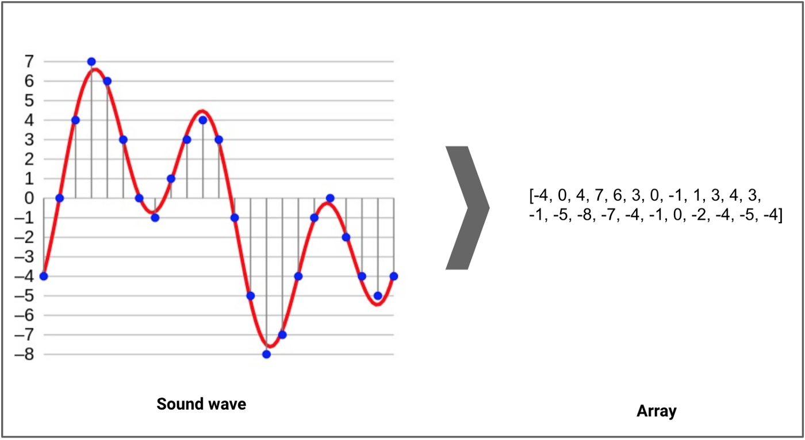

> *-- 音频数据预处理笔记*

1. **sampling rate** 
 采样率 （ typically 44.1kHz for CD quality audio meaning samples are taken 44,100 times per second）
	采样是指将音频的振幅（一般分为16位）用数字表示出来。
	（96k-8k）
	
2. **Audio channels**
   stereo / mono （类似双声道/单声道）
3. **Bit depth**
   刚刚提到的“一般分为16位” -- 4bit-32bit
	
## 参考
[[1] Sound Classification using Deep Learning](https://mikesmales.medium.com/sound-classification-using-deep-learning-8bc2aa1990b7)